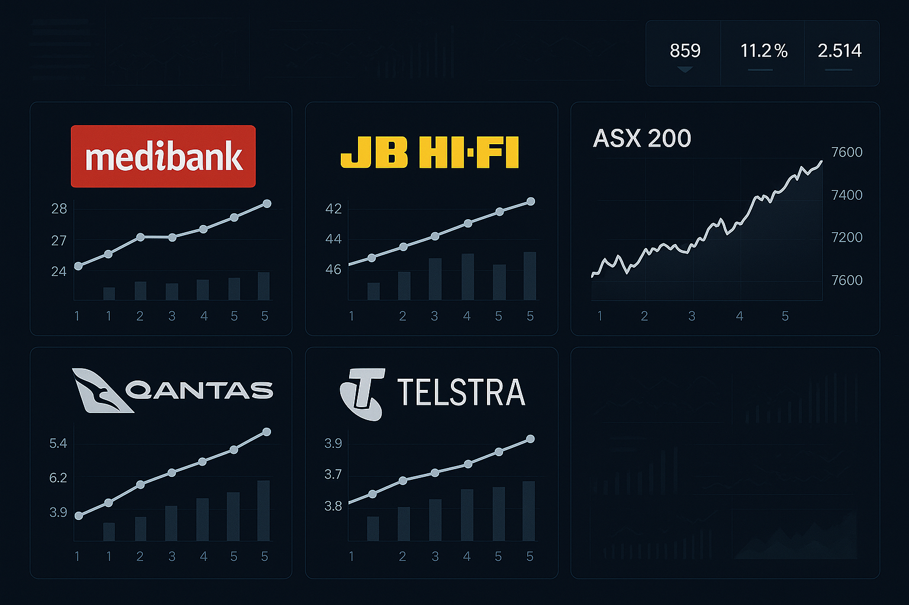

# aus-multi-industry-finance-analysis

## 專案簡介 / Project Overview
本專案蒐集與分析澳洲上市公司（Medibank, JB Hi-Fi, Qantas, Telstra）及ASX200指數，以Excel/Python進行數據清理、日報酬率計算、CAPM回歸、Beta分析及多角度產業績效比較。

## 資料結構 / Repository Structure
- data/：原始數據與清理後Excel檔案
- notebooks/ 或 scripts/：數據自動化處理、回歸分析程式
- reports/：主要結論／圖表／ppt／作品集佐證

## 亮點與技能 / Highlights & Skills
- 橫跨金融、保險、零售、航空產業的市場數據處理與比較
- 金融計量模型 (如 Beta, CAPM)
- 數據自動化與Python/Excel混合應用
- 輸出可直接用於履歷或作品集的分析摘要圖與結果

## Demo

## 聯絡方式 / Contact
聯繫：tg0977068715@gmail.com
